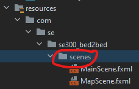
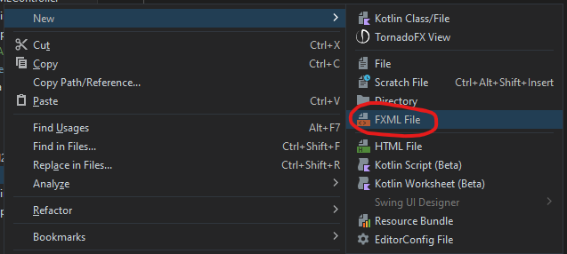
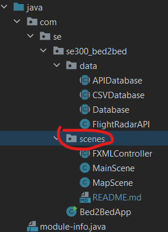
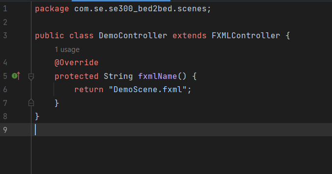
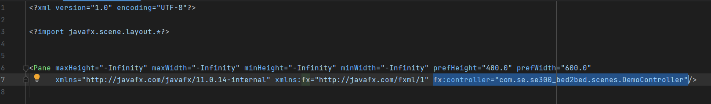
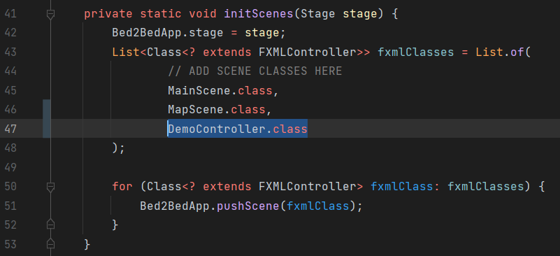

# How to make a new scene
****
### 1) Create .fxml file

**Right-click the scenes directory in resource folder**

**Select FXML file**

Name this file appropriately

### 2) Create a controller for your new scene

#### Add a new java file in the scenes package 

#### Make this new class extend the FXMLController Class

#### Set fxmlName():
Override the function "fxmlName()" and return a string of the .fxml file you previously created

### 3) Add your controller to your .fxml file

At the end of the first tag in the .fxml file add the package name of your new controller class

_fx:controller="com.se.se300_bed2bed.scenes.**controller_name**"_

### 4) Finally add your controller class to the scene list in the

Within the Bed2BedApp class, add your new scene in the initScenes method

