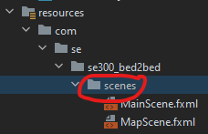
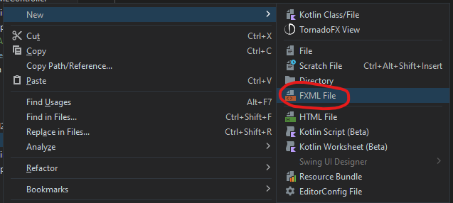

# How to make a new scene
****
### 1) Create .fxml file

**Right-click the scenes directory in resource folder**

**Select FXML file**

Name this file appropriately

### 2) Create a controller for your new scene

